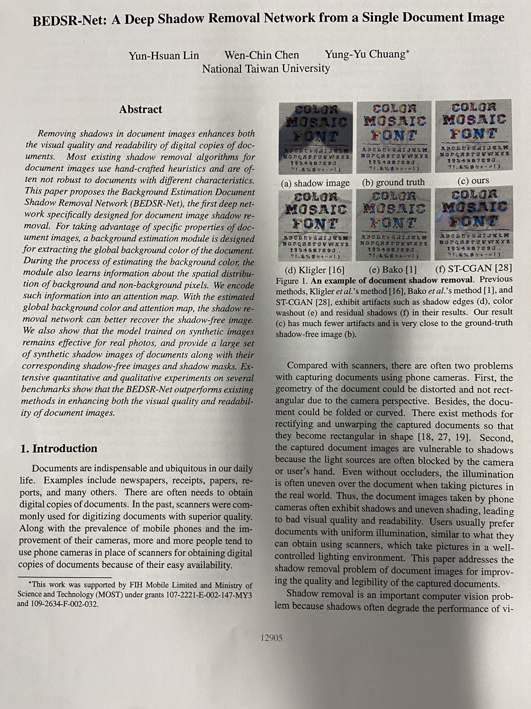
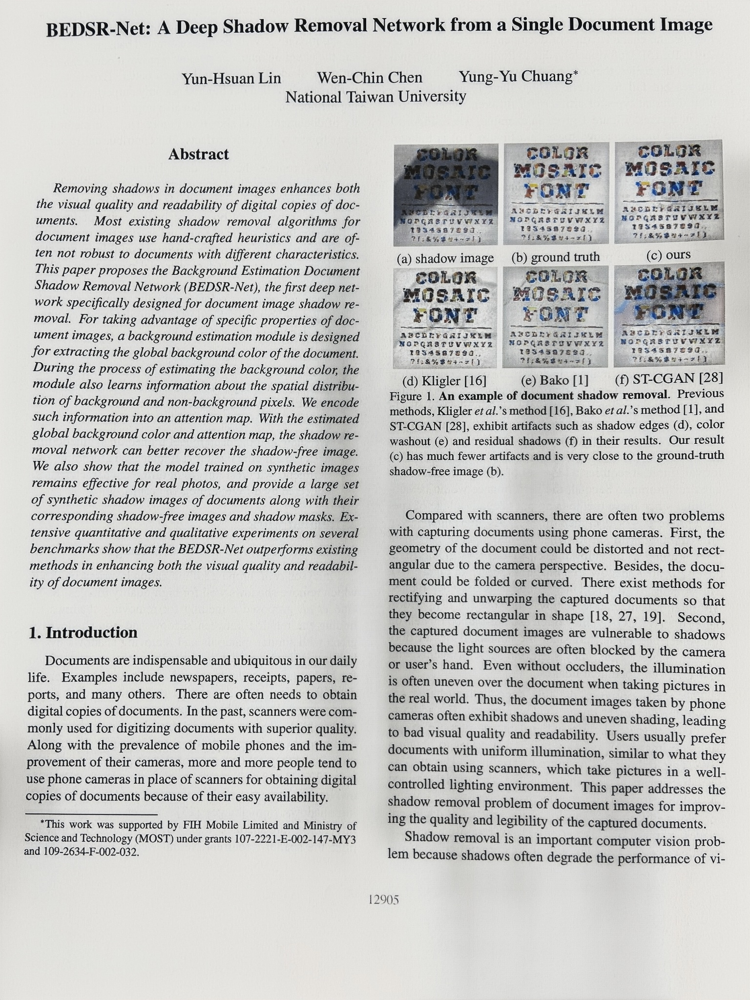
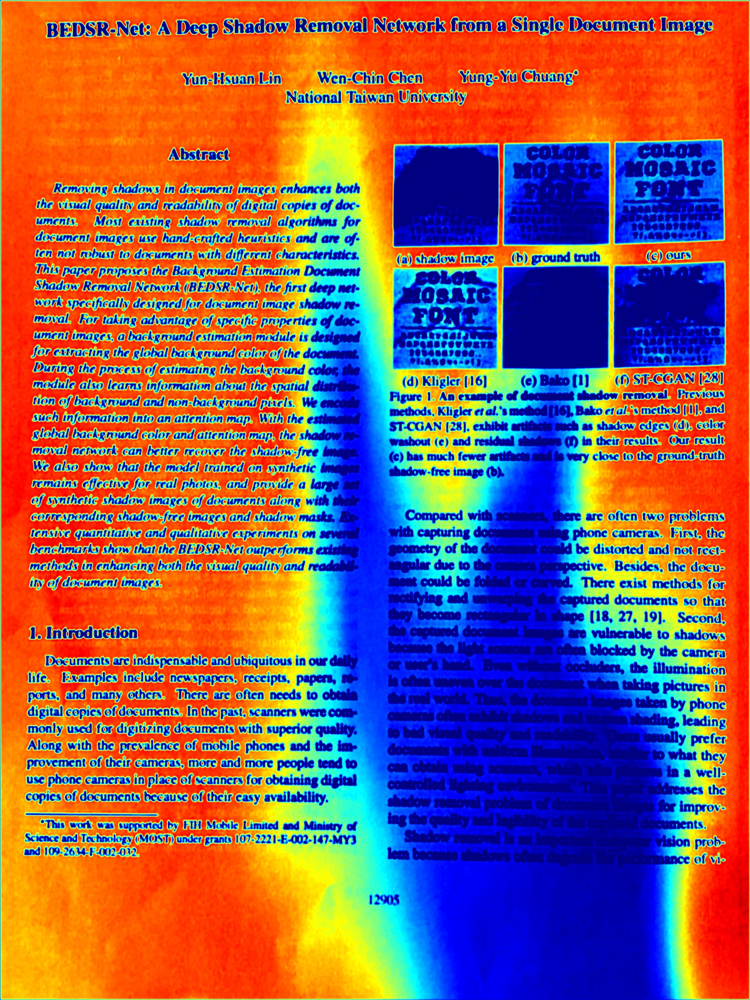

# BEDSR-Net A Deep Shadow Removal Network from a Single Document Image

This repository is unofficial implementation of  [BEDSR-Net: A Deep Shadow Removal Network From a Single Document Image](https://openaccess.thecvf.com/content_CVPR_2020/html/Lin_BEDSR-Net_A_Deep_Shadow_Removal_Network_From_a_Single_Document_CVPR_2020_paper.html) [Lin+, **CVPR** 2020] with PyTorch.

### | [🔥Online Demo!(Google CoLab)](https://github.com/IsHYuhi/BEDSR-Net_A_Deep_Shadow_Removal_Network_from_a_Single_Document_Image/blob/main/demo.ipynb) |


## Results
### Results from BEDSR-Net pretrained on Jung dataset  

|Shadow image|Non-shadow image|Attention Map|Background color|
|:-:|:-:|:-:|:-:|
|||||

## Requirements
* Python3.x
* PyTorch 1.8.0
* matplotlib==3.4.2
* albumentations==0.4.6


## Training
You can download the Jung dataset: [csv](https://drive.google.com/file/d/1NS4cxMwoGrWlHv6uyf8iVFAUN-xmw5vb/view?usp=sharing)/[images](https://drive.google.com/file/d/192dqE4K6zuxD0tNre9UHDwu4YB4uxSnG/view?usp=sharing). 

The data folders should be:
```
./csv
   - /Jung
       - /train.csv
       - /val.csv
       - /test.csv
       
./dataset
    - /Jung
        - /train
            - /img
            - /gt
            ...
        - /val
            - /img
            - /gt
            ...
        - /test
            - /img
            - /gt
            ...
```
### Making configs
```python3 utils/make_configs.py --model benet bedsrnet```
### Training BE-Net
```python3 train_benet.py ./configs/model\=benet/config.yaml```
### Training BEDSR-Net
```python3 train_bedsrnet.py ./configs/model\=bedsrnet/config.yaml```

## Testing

### Trained model
You can download [pretrained models](https://drive.google.com/file/d/1leCrtOLOB6xWGhCFdc2agFQtV21z41Yq/view?usp=sharing) trained on Jung dataset.

When you would like to test your own image, you can use [demo.ipynb](https://github.com/IsHYuhi/BEDSR-Net_A_Deep_Shadow_Removal_Network_from_a_Single_Document_Image/blob/main/demo.ipynb) .

## References
* BEDSR-Net_A_Deep_Shadow_Removal_Network_from_a_Single_Document_Image, Yun-Hsuan Lin, Wen-Chin Chen, Yung-Yu Chuang, **National Taiwan University**, [[paper]](https://openaccess.thecvf.com/content_CVPR_2020/html/Lin_BEDSR-Net_A_Deep_Shadow_Removal_Network_From_a_Single_Document_CVPR_2020_paper.html)

## TODO
* [x] implementation of BE-Net
* [x] training code for BE-Net
* [x] implementation of SR-Net
* [x] training code for BEDSR-Net
* [ ] implementation of ST-CGAN-BE
* [ ] calculating code (PSNR/SSIM)
* [x] inference code
* [x] Democode in Colab.
* [x] cleaning up / formatting 
* [ ] Writing README
* [ ] providing pretrained model
* [ ] providing synthesized data
